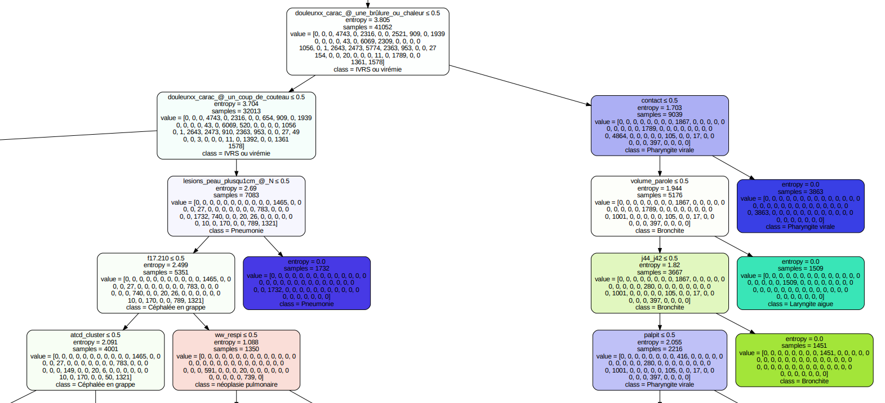

# Project Koh

## Project description

Project Koh is an AI based application for medical students to practice diagnosis procedure on simulated patients. 

The app simulates patients with some pathology and corresponding symptoms and antecedents. The goal of user is to have a talk with imaginary patient and ask some questions. Based on responses of the patient, user has to conclude with a diagnosis.

After this, the application displays correct result and provides some metrics on their diagnosis procedure and suggestions on how to improve that.

## What has been done so far

**Technology choosing**

Initial idea was to use Decision Trees because of its nature which resembles a talk of a doctor with a patient, that is the doctor is asking a question, the patient answers it.

Some other models were also considered, among them:

1. **Bayes networks (evidence optimization)**
    
    [https://www.bayesserver.com/examples/demos/ai-doctor](https://www.bayesserver.com/examples/demos/ai-doctor)
    
2. **Deep Q-learning based Rainbow**
    
    [https://github.com/mila-iqia/Casande-RL](https://github.com/mila-iqia/Casande-RL)
    

The problem with those is even though they are obviously more complex and give accurate chain of questions, there is no way to access quality of users’ questions.

Whereas Decision Trees by their nature work trying to minimize entropy with every question. That is how we are going to rate users’ question.

**Dataset choosing**

So far two dataset were considered.

1. [https://github.com/itachi9604/healthcare-chatbot/blob/master/Data/Training.csv](https://github.com/itachi9604/healthcare-chatbot/blob/master/Data/Training.csv)
    
    After removing duplicates the dataset has 40 pathologies, 133 symptoms, and 410 rows of training data.
    
2. [https://figshare.com/articles/dataset/DDXPlus_Dataset/20043374](https://figshare.com/articles/dataset/DDXPlus_Dataset/20043374)
    
    This dataset has 49 pathologies, 223 symptoms, and 1025602 (!) rows of training data.
    
    Let’s construct a Decision Tree for this dataset. A part of the constructed Decision Tree is on the picture:
    
    
    
    Initially it is in French. So it was decided to translate it.
    
    
    

## State of the app on 15 Nov

[bandicam 2023-11-15 23-34-50-723.mp4](media/bandicam_2023-11-15_23-34-50-723.mp4)

Demo was recorded using g4f and dataset 1.

## What is left to do

Train NLP model for the Chat

Add evaluation of questions on-the-go